# 🧠 Active Directory Attack + Detection Engineering Lab

## 🔍 Overview
This project demonstrates a full **Active Directory attack lifecycle**, combined with **detection engineering and network-based monitoring** using **Suricata, Raspberry Pi, and Grafana**.

The objective is to simulate real-world adversary behavior in an enterprise AD environment and build visibility through detection pipelines — mimicking modern SOC and detection engineering workflows.

---

## ⚙️ Architecture

<p align="center">
  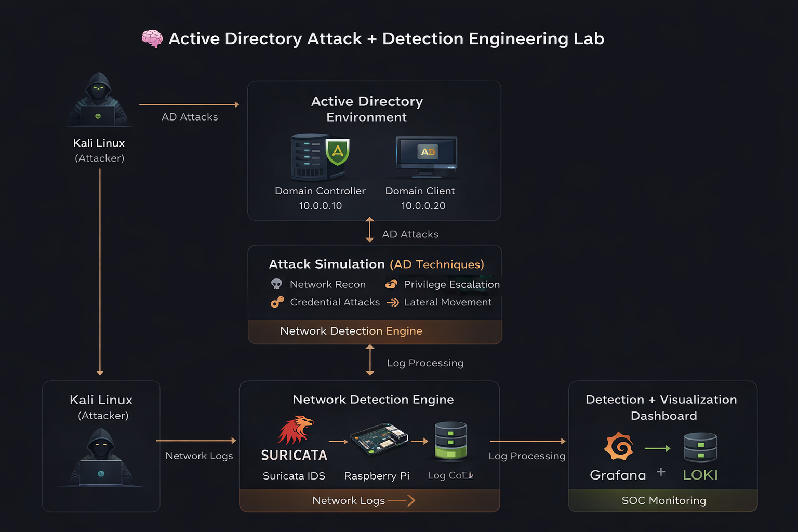
</p>

### 🔄 Data Flow

- **Kali Linux (Attacker)** → Executes AD attacks  
- **Active Directory (DC + Client)** → Target environment  
- **Suricata (IDS)** → Captures network activity  
- **Raspberry Pi (Log Collector)** → Aggregates logs  
- **Grafana + Loki** → Visualization and analysis  

---

## 🧪 Attack Scenarios

### 1. Network Reconnaissance
- Identified hosts and services using SMB scanning  
- Mapped Domain Controller and client systems  

```bash
crackmapexec smb 10.0.0.0/24
```

**MITRE ATT&CK Mapping:**
- T1046 – Network Service Discovery  
- T1018 – Remote System Discovery
  
---

### 2. LDAP Enumeration
- Enumerated domain users and computers  
- Extracted AD structure using low-privileged credentials  

```bash
ldapsearch -x -H ldap://10.0.0.10 -D "lab\\john" -w Password123 -b "dc=lab,dc=local" "(objectClass=user)" sAMAccountName
```

**MITRE ATT&CK Mapping:**
- T1087 – Account Discovery  
- T1482 – Domain Trust Discovery  

---

### 3. SMB Enumeration
- Discovered accessible shares  
- Accessed data using valid credentials  
- Demonstrated potential data exposure  

**MITRE ATT&CK Mapping:**
- T1135 – Network Share Discovery  
- T1021.002 – SMB/Windows Admin Shares
  
---

### 4. Password Spraying
- Identified weak credentials across users  
- Avoided account lockouts  

```bash
crackmapexec smb 10.0.0.0/24 -u john -p Password123
```

**MITRE ATT&CK Mapping:**
- T1110.003 – Password Spraying
  
---

### 5. Kerberoasting
- Extracted service account tickets (SPN-based)  
- Cracked credentials offline  

```bash
impacket-GetUserSPNs lab.local/john:Password123 -dc-ip 10.0.0.10 -request
```

**MITRE ATT&CK Mapping:**
- T1558.003 – Kerberoasting
  
---

### 🔓 Password Cracking (Offline Attack)
- Extracted Kerberos ticket hashes  
- Performed offline cracking using John the Ripper  
- Recovered plaintext credentials  

```bash
john --wordlist=word.txt Hash.txt
```

**MITRE ATT&CK Mapping:**
- T1110 – Brute Force  

---

### 6. BloodHound Enumeration
- Collected AD relationship data  
- Identified privilege escalation paths  

```bash
bloodhound-python -d lab.local -u john -p Password123 -dc dc01.lab.local -ns 10.0.0.10 --dns-tcp --disable-autogc -c all --zip
```

**MITRE ATT&CK Mapping:**
- T1482 – Domain Trust Discovery  
- T1069.002 – Permission Groups Discovery (Domain Groups)  

---

### 7. Privilege Escalation
- Misconfiguration allowed Domain Admin privileges  
- Demonstrated full domain compromise  

**MITRE ATT&CK Mapping:**
- T1068 – Exploitation for Privilege Escalation  
- T1078 – Valid Accounts
  
---

### 8. Lateral Movement
- Executed commands across domain systems  
- Validated administrative control  

**MITRE ATT&CK Mapping:**
- T1021 – Remote Services  
- T1021.002 – SMB/Windows Admin Shares
  
---

## 🧠 Detection Engineering

This project includes **network-based detection engineering** using Suricata to identify attack patterns across the AD environment.

---

### 🔐 Detection 1: Network Recon (Scanning)

**Description:** Detects high-volume scanning activity  

```bash
alert tcp any any -> any any (msg:"NMAP Scan Detected"; flags:S; threshold:type both, track by_src, count 10, seconds 5; sid:1000001;)
```

**MITRE ATT&CK:**
- T1046 – Network Service Discovery  

---

### 📂 Detection 2: SMB Activity

**Description:** Identifies SMB enumeration activity  

```bash
alert tcp any any -> any 445 (msg:"SMB Connection Detected"; sid:1000002;)
```

---

### 🧨 Detection 3: Lateral Movement

```bash
alert tcp any any -> any 445 (msg:"Possible Lateral Movement SMB Burst"; threshold:type both, track by_src, count 5, seconds 10; sid:1000003;)
```

---

### 🔥 Detection 4: Kerberos Activity

```bash
alert tcp any any -> any 88 (msg:"Kerberos Activity Detected"; sid:1000004;)
```

---

### 🧾 Detection 5: NTLM Authentication

```bash
alert tcp any any -> any 445 (msg:"NTLM Authentication Attempt"; content:"NTLMSSP"; sid:1000005;)
```

---

## 🚨 Detection Summary

The following attack behaviors were successfully detected:

- Network scanning  
- SMB enumeration  
- Credential attacks  
- Kerberos activity  
- Lateral movement  

---

## 📊 Log Pipeline

Suricata → Raspberry Pi → Loki → Grafana  

---

## 📈 Results

- Successfully simulated a complete Active Directory attack lifecycle, covering reconnaissance, credential access, privilege escalation, and lateral movement  
- Generated and captured high-fidelity network telemetry using Suricata across multiple attack stages  
- Established end-to-end visibility into attacker behavior through centralized logging and monitoring pipelines  
- Validated detection capabilities by correlating attack activity with custom IDS rules and real-time dashboards 

---

## 🛠️ Technologies Used

- Active Directory  
- Kali Linux  
- CrackMapExec  
- Impacket  
- BloodHound  
- Suricata IDS  
- Raspberry Pi  
- Grafana + Loki  

---

## 🛡️ Key Learnings

- Deep understanding of Active Directory attack techniques, including enumeration, Kerberoasting, and privilege escalation paths  
- Practical experience in identifying and exploiting weak credentials and misconfigurations within enterprise environments  
- Hands-on implementation of detection engineering using network-based telemetry and IDS rule development  
- Strengthened SOC investigation skills through log analysis, attack correlation, and behavioral tracking  
- Applied MITRE ATT&CK framework to map adversary techniques and validate detection coverage 

---

## 📸 Attack Demonstration

### 🔍 Network Recon

<p align="center">
  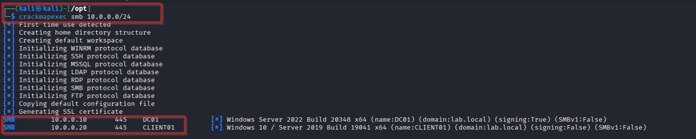
</p>

---

### 🔐 LDAP Enumeration

<p align="center">
  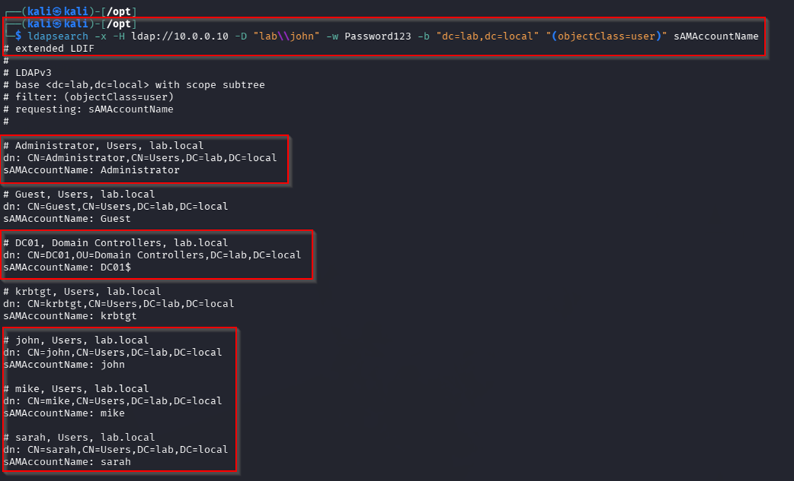
</p>

---

### 📂 SMB Enumeration

<p align="center">
  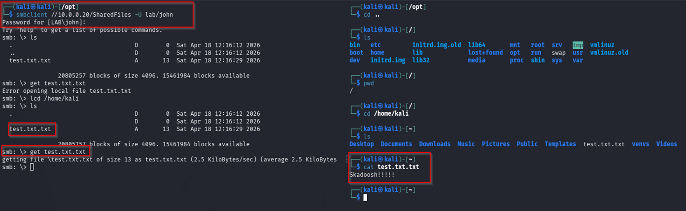
</p>

---

### 🔓 Password Spraying

<p align="center">
  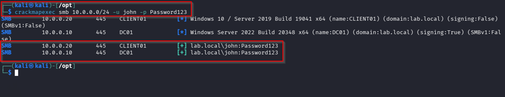
</p>

---

### 🔥 Kerberoasting

<p align="center">
  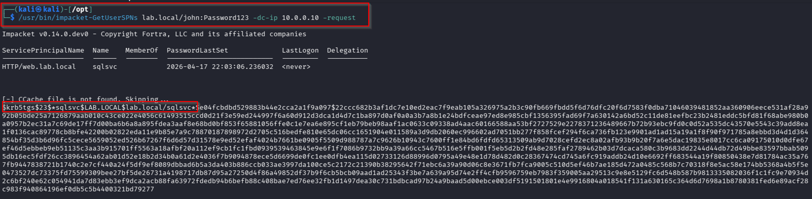
</p>

---

### 🔓 Password Cracking

<p align="center">
  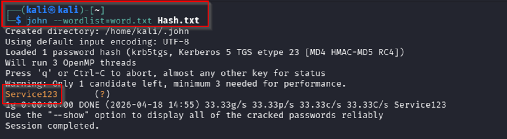
</p>

---

### 🧠 BloodHound Analysis

<p align="center">
  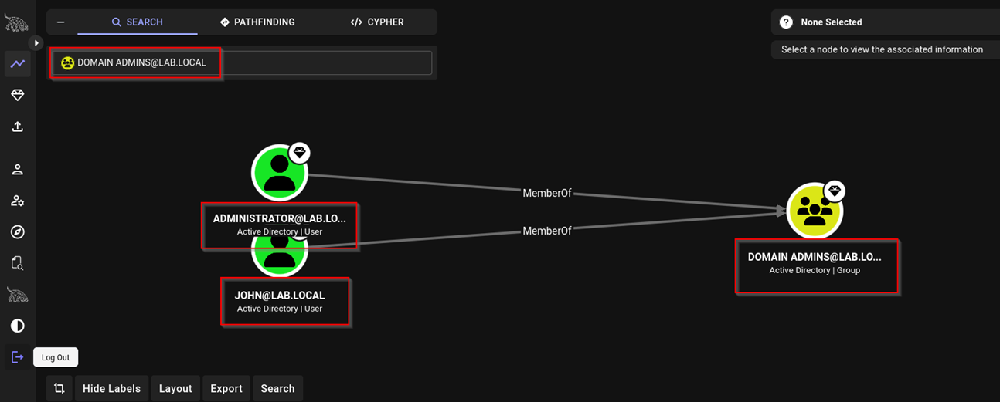
</p>

---

### 🚨 Privilege Escalation

<p align="center">
  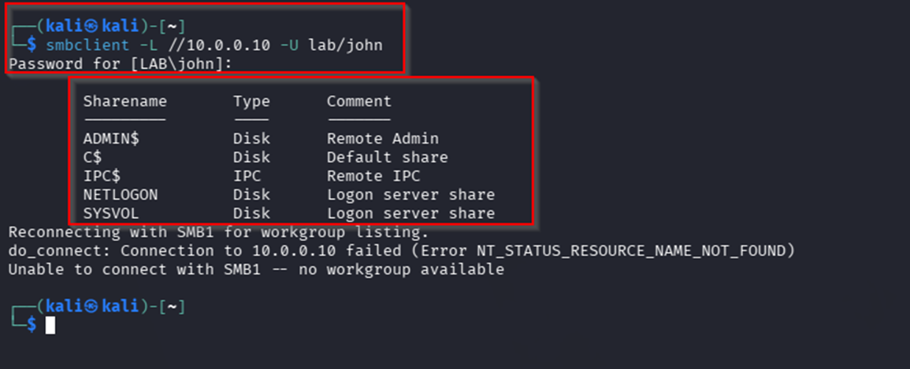
</p>

---

### 🧨 Lateral Movement

<p align="center">
  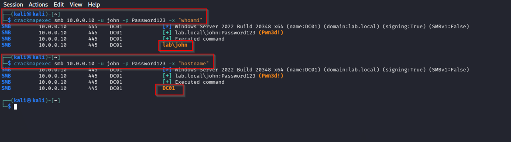
</p>

---

### 📊 Grafana Dashboard

<p align="center">
  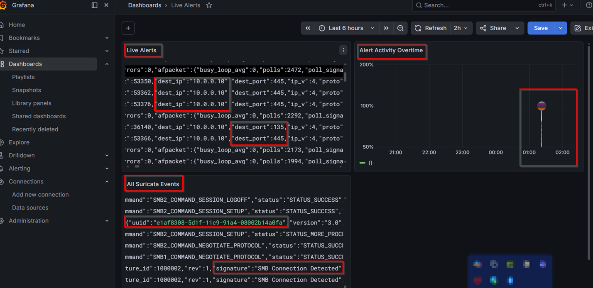
</p>

---

### 🛡️ Suricata Alerts (fast.log)

<p align="center">
  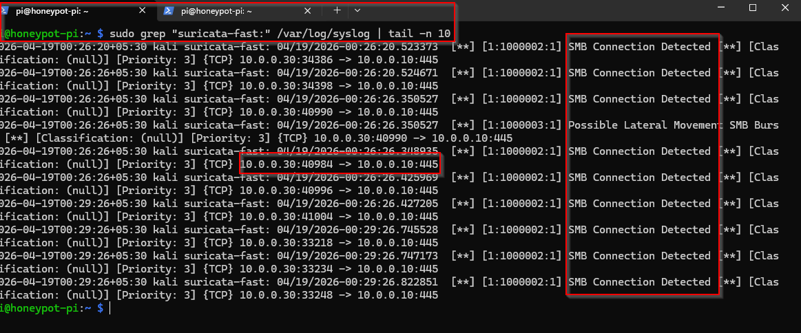
</p>

---

### 🧾 Suricata Logs (eve.json)

<p align="center">
  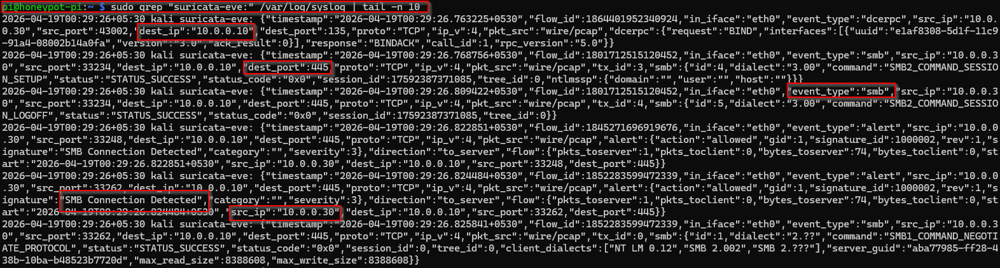
</p>

---

## 💼 Professional Relevance

This project demonstrates hands-on experience in:

- Active Directory Attack Techniques (Enumeration, Kerberoasting, Privilege Escalation, Lateral Movement)  
- Detection Engineering using network-based telemetry  
- Threat Hunting and attacker behavior analysis  
- SOC Monitoring and incident investigation workflows  
- Active Directory Security and misconfiguration exploitation  

It reflects real-world enterprise attack scenarios and detection workflows, aligning with responsibilities of SOC Analysts, Detection Engineers, and Security Analysts.

---

## 📌 Conclusion

This project demonstrates a complete end-to-end security operations workflow, encompassing adversary simulation, telemetry generation, detection engineering, and analytical investigation within an Active Directory environment.

It showcases the ability to emulate real-world attack techniques, capture and process security-relevant data, and develop meaningful detections aligned with enterprise SOC operations.

Overall, the project reflects strong practical proficiency across both offensive and defensive security domains, with a focus on understanding attacker behavior and building effective detection strategies using industry-standard tools.

